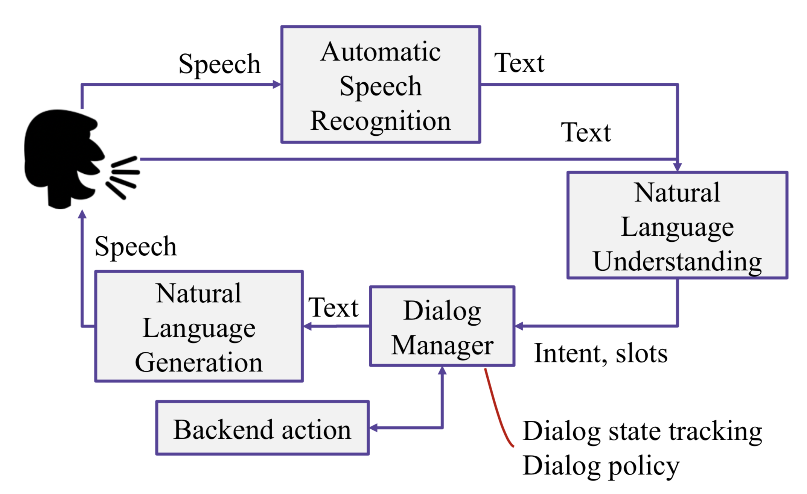
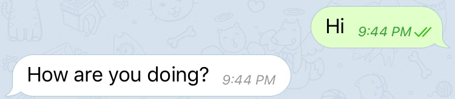
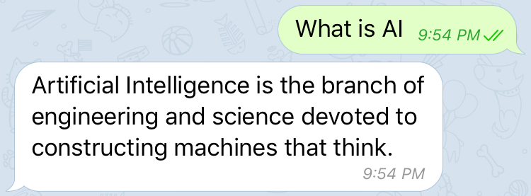
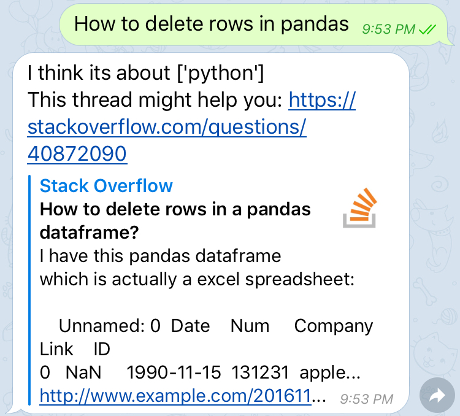
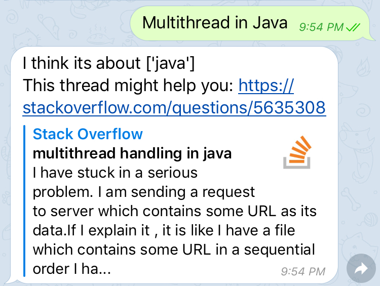

	

# Stack overflow assistant chatbot
We designed and developed a chatbot that can talk with users through some normal conversations(without context). If users ask some programming related questions like 'What's the dataframe in pandas', this bot could recognize related programming language(like in this question language is python, but there is no 'python' in the sentence) and recommend the most similar question on [Stack Overflow](https://stackoverflow.com/). 
## Requirement
- You could find the requirements for this project [here](requirements.txt).
- We recommend to run the project in docker as well. 
- This chatbot could run on Telegram, you could find more interesting functions on their official website [Telegram](https://telegram.org/).

## How does it work
Task-oriented dialog system structure is as follow:

In this project we mostly focus on Natural Language Understanding: intent classifier and slot tagger.

- We trained intent classifier by concatenating two datasets: movie dialogues and StackOverflow posts. This intent classifier could figure out the intention of questions and it got 0.994 accuracy on the test set. 
- After getting the intention, the next step is to do the slot tagging. Since we used the dataset with 10 programming languages, tag classifier has to predict corresponding tag based on the question. Model got 0.882 accuracy at this part. 
- In order to improve the performance of NLU, we used pretrained BERT to do question_to_vec and ranked most similar one in the related vectorized tag corpus to give the best recommendation. 

## How does it look like
### - conversations of questions classified as stackoverflow one

### - conversations of questions classified as normal one

## What to do next
Current chit-chat function is implemented by pre-trained neural network engine by [ChatterBot](https://chatterbot.readthedocs.io/en/stable/), which builds a ranking system that scores predefined replicas given the question. However, this method always generates unsuccessful conversations. We could train the chit-chat part by seq2seq + attention-mechanism which is popular in machine translation and dialogue systems. This updated part is coming soon! 
